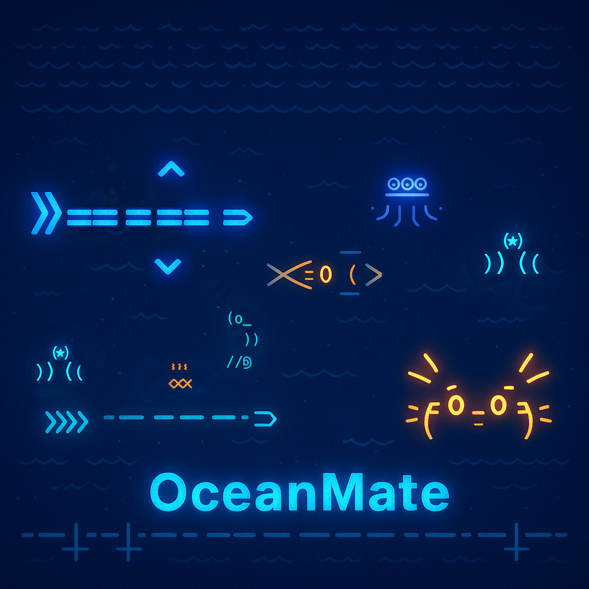

# OceanMate-ASCII

OceanMate is a marine-themed ASCII animation project built using Python. It simulates an interactive underwater world where fish swim, interact with bubbles, and respond to user actions.

## 🌊 Features

- ASCII-rendered ocean creatures including clownfish, turtles, and jellyfish
- Feeding system to increase fish happiness
- Modular Python design with separate game logic and display files
- Dynamic background animation and movement
- Educational and relaxing gameplay style

## 🖼 Demo

Here is a snapshot of the OceanMate ASCII animation in action:

## 📁 Project Structure

- `main.py` – Game entry point
- `game/display.py` – Controls the ocean animation and layout
- `game/fish.py` – Defines fish classes and behavior
- `game/bubble.py`, `game/garbage.py`, `game/chase.py` – Additional interactive modules
- `game/action.py` – User interaction handling

## 🧠 Technologies Used

- Python 3
- ASCII art
- Terminal-based UI
- Object-Oriented Programming (OOP)

## 🎯 Goal

OceanMate aims to combine programming creativity with environmental themes, creating a simple but beautiful digital aquarium experience through code.

## 💡 Author

Created by [Mars-1010](https://github.com/Mars-1010)  
